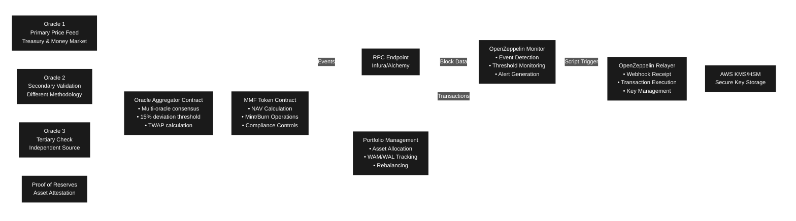

# MMF Architecture - Horizontal Layout for Slides

## Complete System Architecture (Horizontal)

```mermaid
%%{init: {'theme':'dark', 'themeVariables': { 'primaryColor':'#1a1a1a', 'primaryTextColor':'#fff', 'primaryBorderColor':'#7C4DFF', 'lineColor':'#F5F5F5', 'secondaryColor':'#006064', 'tertiaryColor':'#1a1a1a', 'background':'transparent', 'mainBkg':'#1a1a1a', 'secondBkg':'#1a1a1a', 'tertiaryBkg':'#1a1a1a', 'primaryBorderColor':'#fff', 'secondaryBorderColor':'#fff', 'tertiaryBorderColor':'#fff', 'primaryTextColor':'#fff', 'secondaryTextColor':'#fff', 'tertiaryTextColor':'#fff', 'lineColor':'#fff', 'textColor':'#fff', 'nodeTextColor':'#fff' }}}%%
graph LR
    subgraph Oracles[" "]
        O1[Oracle 1<br/>Primary Price Feed<br/>Treasury & Money Market]
        O2[Oracle 2<br/>Secondary Validation<br/>Different Methodology]
        O3[Oracle 3<br/>Tertiary Check<br/>Independent Source]
        POR[Proof of Reserves<br/>Asset Attestation]
    end
    
    OA[Oracle Aggregator Contract<br/>• Multi-oracle consensus<br/>• 15% deviation threshold<br/>• TWAP calculation]
    
    MMF[MMF Token Contract<br/>• NAV Calculation<br/>• Mint/Burn Operations<br/>• Compliance Controls]
    
    PM[Portfolio Management<br/>• Asset Allocation<br/>• WAM/WAL Tracking<br/>• Rebalancing]
    
    subgraph Infrastructure[" "]
        RPC[RPC Endpoint<br/>Infura/Alchemy]
        MON[OpenZeppelin Monitor<br/>• Event Detection<br/>• Threshold Monitoring<br/>• Alert Generation]
        REL[OpenZeppelin Relayer<br/>• Webhook Receipt<br/>• Transaction Execution<br/>• Key Management]
        KMS[AWS KMS/HSM<br/>Secure Key Storage]
    end
    
    O1 --> OA
    O2 --> OA
    O3 --> OA
    POR --> OA
    
    OA --> MMF
    MMF --> PM
    
    MMF -.->|Events| RPC
    RPC -->|Block Data| MON
    MON -->|Script Trigger| REL
    REL -->|Transactions| MMF
    REL --> KMS
    
    style O1 fill:#1a1a1a,stroke:#fff,stroke-width:2px,color:#fff
    style O2 fill:#1a1a1a,stroke:#fff,stroke-width:2px,color:#fff
    style O3 fill:#1a1a1a,stroke:#fff,stroke-width:2px,color:#fff
    style POR fill:#1a1a1a,stroke:#fff,stroke-width:2px,color:#fff
    style OA fill:#1a1a1a,stroke:#fff,stroke-width:2px,color:#fff
    style MMF fill:#1a1a1a,stroke:#fff,stroke-width:2px,color:#fff
    style PM fill:#1a1a1a,stroke:#fff,stroke-width:2px,color:#fff
    style RPC fill:#1a1a1a,stroke:#fff,stroke-width:2px,color:#fff
    style MON fill:#1a1a1a,stroke:#fff,stroke-width:2px,color:#fff
    style REL fill:#1a1a1a,stroke:#fff,stroke-width:2px,color:#fff
    style KMS fill:#1a1a1a,stroke:#fff,stroke-width:2px,color:#fff
    style Oracles fill:transparent,stroke:#fff,stroke-width:1px,color:#fff
    style Infrastructure fill:transparent,stroke:#fff,stroke-width:1px,color:#fff
```