# Detailed Horizontal Roadmap for Slides

## Complete Implementation Roadmap with All Services

```mermaid
graph LR
    subgraph P1["Phase 1: Architecture & Design"]
        P1A["Security Advisory & Consulting:<br/>• Strategic MMF architecture review<br/>• Oracle selection strategy<br/>• Key management architecture (HSM/KMS)<br/>• Access control and role design<br/>Deliverable: Complete security architecture"]
    end
    
    subgraph P2["Phase 2: Development"]
        P2A["Security Advisory & Consulting:<br/>• On-call for security questions<br/><br/>AcmeBank Development:<br/>• Your team builds MMF contracts<br/>• Your team develops test coverage<br/>Deliverable: Complete codebase ready for audit"]
    end
    
    subgraph P3["Phase 3: Security Validation"]
        P3A["Smart Contract Security Audit:<br/>• Comprehensive vulnerability assessment<br/><br/>Blockchain Infrastructure Security Assessment:<br/>• Node, RPC, bridge security<br/><br/>Operational Security Review:<br/>• Key management, deployment, governance<br/>Deliverable: Audit reports with remediation"]
    end
    
    subgraph P4["Phase 4: OSS Tooling"]
        P4A["Monitors (OSS):<br/>• Deploy real-time anomaly detection<br/><br/>Relayers (OSS):<br/>• Configure automated transaction execution<br/><br/>Integration:<br/>• Connect Monitor to Relayer via script triggers<br/>Deliverable: Operational monitoring stack"]
    end
    
    subgraph P5["Phase 5: Operational Readiness"]
        P5A["Incident Response Training & Simulations:<br/>• Oracle failures, bank runs<br/>• Develop response procedures<br/><br/>Operational Security Review:<br/>• Final pre-launch assessment<br/>Deliverable: Trained team with tested procedures"]
    end
    
    subgraph P6["Phase 6: Production & Support"]
        P6A["Security Advisory & Consulting:<br/>• Go-live support<br/>• Quarterly reviews<br/><br/>Monitors & Relayers:<br/>• 24/7 operational coverage<br/><br/>Smart Contract Security Audit:<br/>• Annual re-audit<br/>Deliverable: Secure production MMF"]
    end
    
    P1 --> P2
    P2 --> P3
    P3 --> P4
    P4 --> P5
    P5 --> P6
    
    style P1 fill:#f9f9f9,stroke:#333,stroke-width:2px
    style P2 fill:#f9f9f9,stroke:#333,stroke-width:2px
    style P3 fill:#f9f9f9,stroke:#333,stroke-width:2px
    style P4 fill:#f9f9f9,stroke:#333,stroke-width:2px
    style P5 fill:#f9f9f9,stroke:#333,stroke-width:2px
    style P6 fill:#f9f9f9,stroke:#333,stroke-width:2px
```



## Generate the diagram:
```bash
mmdc -i roadmap-detailed.md -o roadmap-horizontal-detailed.png -t neutral -b transparent -s 3 -w 1920 -H 1080
```