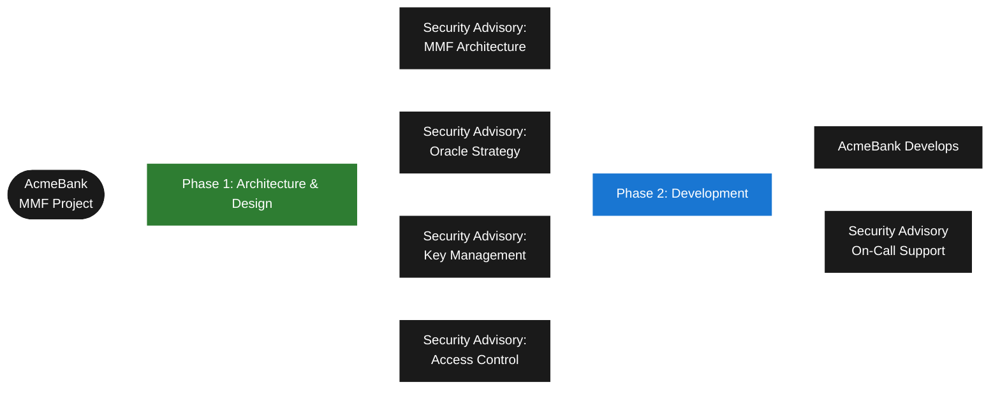

# OpenZeppelin MMF Security Services Timeline - Part 1

## Phases 1-2: Architecture & Development

```mermaid
%%{init: {'theme':'dark', 'themeVariables': { 'primaryColor':'#1a1a1a', 'primaryTextColor':'#fff', 'primaryBorderColor':'#7C4DFF', 'lineColor':'#F5F5F5', 'secondaryColor':'#006064', 'tertiaryColor':'#1a1a1a', 'background':'transparent', 'mainBkg':'#1a1a1a', 'secondBkg':'#1a1a1a', 'tertiaryBkg':'#1a1a1a', 'primaryBorderColor':'#fff', 'secondaryBorderColor':'#fff', 'tertiaryBorderColor':'#fff', 'primaryTextColor':'#fff', 'secondaryTextColor':'#fff', 'tertiaryTextColor':'#fff', 'lineColor':'#fff', 'textColor':'#fff', 'nodeTextColor':'#fff' }}}%%
flowchart LR
    Start([AcmeBank<br/>MMF Project])
    
    Start --> P1[Phase 1: Architecture & Design]
    
    P1 --> P1A[Security Advisory:<br/>MMF Architecture]
    P1 --> P1B[Security Advisory:<br/>Oracle Strategy]
    P1 --> P1C[Security Advisory:<br/>Key Management]
    P1 --> P1D[Security Advisory:<br/>Access Control]
    
    P1A & P1B & P1C & P1D --> P2[Phase 2: Development]
    
    P2 --> P2A[AcmeBank Develops]
    P2 --> P2B[Security Advisory<br/>On-Call Support]
    
    style Start fill:#1a1a1a,stroke:#fff,stroke-width:2px,color:#fff
    style P1 fill:#2E7D32,stroke:#fff,stroke-width:2px,color:#fff
    style P1A fill:#1a1a1a,stroke:#fff,stroke-width:2px,color:#fff
    style P1B fill:#1a1a1a,stroke:#fff,stroke-width:2px,color:#fff
    style P1C fill:#1a1a1a,stroke:#fff,stroke-width:2px,color:#fff
    style P1D fill:#1a1a1a,stroke:#fff,stroke-width:2px,color:#fff
    style P2 fill:#1976D2,stroke:#fff,stroke-width:2px,color:#fff
    style P2A fill:#1a1a1a,stroke:#fff,stroke-width:2px,color:#fff
    style P2B fill:#1a1a1a,stroke:#fff,stroke-width:2px,color:#fff
```