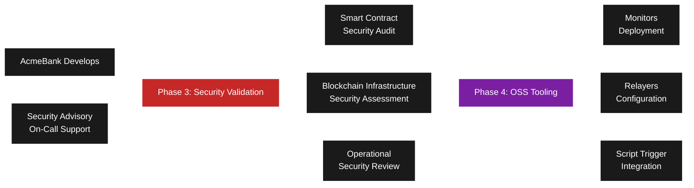

# OpenZeppelin MMF Security Services Timeline - Part 2

## Phases 3-4: Validation & Tooling

```mermaid
%%{init: {'theme':'dark', 'themeVariables': { 'primaryColor':'#1a1a1a', 'primaryTextColor':'#fff', 'primaryBorderColor':'#7C4DFF', 'lineColor':'#F5F5F5', 'secondaryColor':'#006064', 'tertiaryColor':'#1a1a1a', 'background':'transparent', 'mainBkg':'#1a1a1a', 'secondBkg':'#1a1a1a', 'tertiaryBkg':'#1a1a1a', 'primaryBorderColor':'#fff', 'secondaryBorderColor':'#fff', 'tertiaryBorderColor':'#fff', 'primaryTextColor':'#fff', 'secondaryTextColor':'#fff', 'tertiaryTextColor':'#fff', 'lineColor':'#fff', 'textColor':'#fff', 'nodeTextColor':'#fff' }}}%%
flowchart LR
    P2A[AcmeBank Develops]
    P2B[Security Advisory<br/>On-Call Support]
    
    P2A & P2B --> P3[Phase 3: Security Validation]
    
    P3 --> P3A[Smart Contract<br/>Security Audit]
    P3 --> P3B[Blockchain Infrastructure<br/>Security Assessment]
    P3 --> P3C[Operational<br/>Security Review]
    
    P3A & P3B & P3C --> P4[Phase 4: OSS Tooling]
    
    P4 --> P4A[Monitors<br/>Deployment]
    P4 --> P4B[Relayers<br/>Configuration]
    P4 --> P4C[Script Trigger<br/>Integration]
    
    style P2A fill:#1a1a1a,stroke:#fff,stroke-width:2px,color:#fff
    style P2B fill:#1a1a1a,stroke:#fff,stroke-width:2px,color:#fff
    style P3 fill:#C62828,stroke:#fff,stroke-width:2px,color:#fff
    style P3A fill:#1a1a1a,stroke:#fff,stroke-width:2px,color:#fff
    style P3B fill:#1a1a1a,stroke:#fff,stroke-width:2px,color:#fff
    style P3C fill:#1a1a1a,stroke:#fff,stroke-width:2px,color:#fff
    style P4 fill:#7B1FA2,stroke:#fff,stroke-width:2px,color:#fff
    style P4A fill:#1a1a1a,stroke:#fff,stroke-width:2px,color:#fff
    style P4B fill:#1a1a1a,stroke:#fff,stroke-width:2px,color:#fff
    style P4C fill:#1a1a1a,stroke:#fff,stroke-width:2px,color:#fff
```