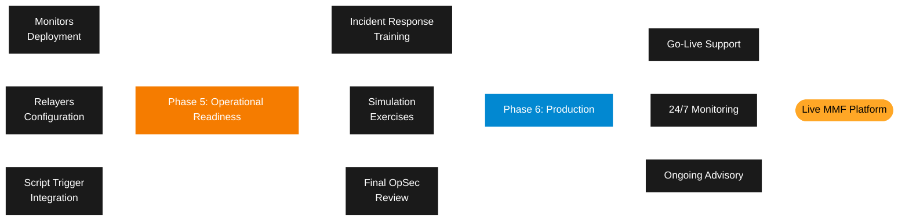

# OpenZeppelin MMF Security Services Timeline - Part 3

## Phases 5-6: Readiness & Production

```mermaid
%%{init: {'theme':'dark', 'themeVariables': { 'primaryColor':'#1a1a1a', 'primaryTextColor':'#fff', 'primaryBorderColor':'#7C4DFF', 'lineColor':'#F5F5F5', 'secondaryColor':'#006064', 'tertiaryColor':'#1a1a1a', 'background':'transparent', 'mainBkg':'#1a1a1a', 'secondBkg':'#1a1a1a', 'tertiaryBkg':'#1a1a1a', 'primaryBorderColor':'#fff', 'secondaryBorderColor':'#fff', 'tertiaryBorderColor':'#fff', 'primaryTextColor':'#fff', 'secondaryTextColor':'#fff', 'tertiaryTextColor':'#fff', 'lineColor':'#fff', 'textColor':'#fff', 'nodeTextColor':'#fff' }}}%%
flowchart LR
    P4A[Monitors<br/>Deployment]
    P4B[Relayers<br/>Configuration]
    P4C[Script Trigger<br/>Integration]
    
    P4A & P4B & P4C --> P5[Phase 5: Operational Readiness]
    
    P5 --> P5A[Incident Response<br/>Training]
    P5 --> P5B[Simulation<br/>Exercises]
    P5 --> P5C[Final OpSec<br/>Review]
    
    P5A & P5B & P5C --> P6[Phase 6: Production]
    
    P6 --> P6A[Go-Live Support]
    P6 --> P6B[24/7 Monitoring]
    P6 --> P6C[Ongoing Advisory]
    
    P6A & P6B & P6C --> Live([Live MMF Platform])
    
    style P4A fill:#1a1a1a,stroke:#fff,stroke-width:2px,color:#fff
    style P4B fill:#1a1a1a,stroke:#fff,stroke-width:2px,color:#fff
    style P4C fill:#1a1a1a,stroke:#fff,stroke-width:2px,color:#fff
    style P5 fill:#F57C00,stroke:#fff,stroke-width:2px,color:#fff
    style P5A fill:#1a1a1a,stroke:#fff,stroke-width:2px,color:#fff
    style P5B fill:#1a1a1a,stroke:#fff,stroke-width:2px,color:#fff
    style P5C fill:#1a1a1a,stroke:#fff,stroke-width:2px,color:#fff
    style P6 fill:#0288D1,stroke:#fff,stroke-width:2px,color:#fff
    style P6A fill:#1a1a1a,stroke:#fff,stroke-width:2px,color:#fff
    style P6B fill:#1a1a1a,stroke:#fff,stroke-width:2px,color:#fff
    style P6C fill:#1a1a1a,stroke:#fff,stroke-width:2px,color:#fff
    style Live fill:#FFA726,stroke:#fff,stroke-width:4px,color:#000
```