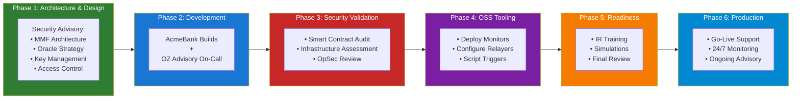
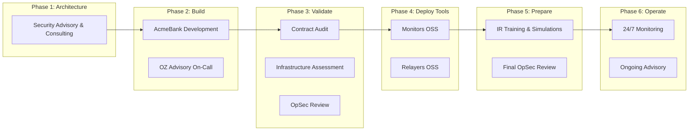
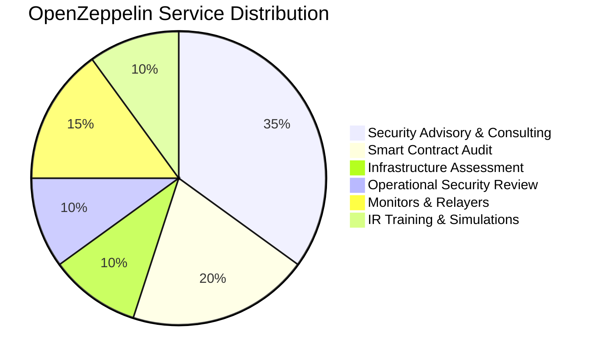

# OpenZeppelin MMF Security Services Timeline

## Service Engagement Flow

```mermaid
flowchart LR
    Start([AcmeBank<br/>MMF Project])
    
    Start --> P1[Phase 1: Architecture & Design]
    
    P1 --> P1A[Security Advisory:<br/>MMF Architecture]
    P1 --> P1B[Security Advisory:<br/>Oracle Strategy]
    P1 --> P1C[Security Advisory:<br/>Key Management]
    P1 --> P1D[Security Advisory:<br/>Access Control]
    
    P1A & P1B & P1C & P1D --> P2[Phase 2: Development]
    
    P2 --> P2A[AcmeBank Develops]
    P2 --> P2B[Security Advisory<br/>On-Call Support]
    
    P2A & P2B --> P3[Phase 3: Security Validation]
    
    P3 --> P3A[Smart Contract<br/>Security Audit]
    P3 --> P3B[Blockchain Infrastructure<br/>Security Assessment]
    P3 --> P3C[Operational<br/>Security Review]
    
    P3A & P3B & P3C --> P4[Phase 4: OSS Tooling]
    
    P4 --> P4A[Monitors<br/>Deployment]
    P4 --> P4B[Relayers<br/>Configuration]
    P4 --> P4C[Script Trigger<br/>Integration]
    
    P4A & P4B & P4C --> P5[Phase 5: Operational Readiness]
    
    P5 --> P5A[Incident Response<br/>Training]
    P5 --> P5B[Simulation<br/>Exercises]
    P5 --> P5C[Final OpSec<br/>Review]
    
    P5A & P5B & P5C --> P6[Phase 6: Production]
    
    P6 --> P6A[Go-Live Support]
    P6 --> P6B[24/7 Monitoring]
    P6 --> P6C[Ongoing Advisory]
    
    P6A & P6B & P6C --> Live([Live MMF Platform])
    
    style P1 fill:#2E7D32,color:#fff
    style P2 fill:#1976D2,color:#fff
    style P3 fill:#C62828,color:#fff
    style P4 fill:#7B1FA2,color:#fff
    style P5 fill:#F57C00,color:#fff
    style P6 fill:#0288D1,color:#fff
    style Live fill:#FFA726,stroke:#333,stroke-width:4px
```

## Service Detail by Phase

```mermaid
flowchart LR
    subgraph P1[Phase 1: Architecture & Design]
        direction TB
        P1A[Security Advisory:<br/>• MMF Architecture<br/>• Oracle Strategy<br/>• Key Management<br/>• Access Control]
    end
    
    subgraph P2[Phase 2: Development]
        direction TB
        P2A[AcmeBank Builds<br/>+<br/>OZ Advisory On-Call]
    end
    
    subgraph P3[Phase 3: Security Validation]
        direction TB
        P3A[• Smart Contract Audit<br/>• Infrastructure Assessment<br/>• OpSec Review]
    end
    
    subgraph P4[Phase 4: OSS Tooling]
        direction TB
        P4A[• Deploy Monitors<br/>• Configure Relayers<br/>• Script Triggers]
    end
    
    subgraph P5[Phase 5: Readiness]
        direction TB
        P5A[• IR Training<br/>• Simulations<br/>• Final Review]
    end
    
    subgraph P6[Phase 6: Production]
        direction TB
        P6A[• Go-Live Support<br/>• 24/7 Monitoring<br/>• Ongoing Advisory]
    end
    
    P1 --> P2 --> P3 --> P4 --> P5 --> P6
    
    style P1 fill:#2E7D32,color:#fff
    style P2 fill:#1976D2,color:#fff
    style P3 fill:#C62828,color:#fff
    style P4 fill:#7B1FA2,color:#fff
    style P5 fill:#F57C00,color:#fff
    style P6 fill:#0288D1,color:#fff
```

## Phased Approach

```mermaid
graph LR
    subgraph "Phase 1: Architecture"
        A1[Security Advisory & Consulting]
    end
    
    subgraph "Phase 2: Build"
        B1[AcmeBank Development]
        B2[OZ Advisory On-Call]
    end
    
    subgraph "Phase 3: Validate"
        C1[Contract Audit]
        C2[Infrastructure Assessment]
        C3[OpSec Review]
    end
    
    subgraph "Phase 4: Deploy Tools"
        D1[Monitors OSS]
        D2[Relayers OSS]
    end
    
    subgraph "Phase 5: Prepare"
        E1[IR Training & Simulations]
        E2[Final OpSec Review]
    end
    
    subgraph "Phase 6: Operate"
        F1[24/7 Monitoring]
        F2[Ongoing Advisory]
    end
    
    A1 --> B1
    B1 --> C1
    C1 --> D1
    D1 --> E1
    E1 --> F1
```

## Service Breakdown by Phase

```mermaid
pie title OpenZeppelin Service Distribution
    "Security Advisory & Consulting" : 35
    "Smart Contract Audit" : 20
    "Infrastructure Assessment" : 10
    "Operational Security Review" : 10
    "Monitors & Relayers" : 15
    "IR Training & Simulations" : 10
```

## Critical Dependencies

```mermaid
flowchart LR
    SA[Security Advisory] -->|Defines| Arch[Architecture]
    Arch -->|Guides| Dev[Development]
    Dev -->|Produces| Code[Codebase]
    Code -->|Input to| Audit[Contract Audit]
    Audit -->|Must Pass| Deploy[Tool Deployment]
    Deploy -->|Requires| Training[IR Training]
    Training -->|Enables| Prod[Production]
    
    style SA fill:#4CAF50
    style Audit fill:#FF5722
    style Deploy fill:#2196F3
    style Prod fill:#FFA726
```